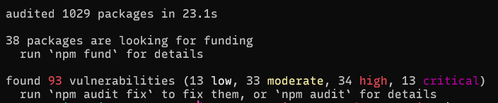
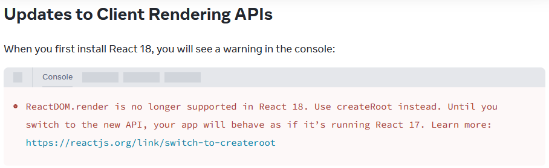

# ADR issue [#1](https://github.com/Palingenae/eonix-clickcounter/issues/1) : migration de l'application
> [!NOTE] Note personnelle
> J'ai pleinement conscience que la mise à jour de ce type de test n'est pas toujours une priorité, mais cela me permet de montrer un peu plus mes méthodes de travail en tant que développeuse. C'est avec une bonne intention que j'écris cette ADR.

## Contexte
Lors de la réception du code de l'application, une première prise de connaissance de l'état de celle-ci a eu lieu dont une installation effectuée en local. L'installation du code de l'application ne fonctionnait pas dans un environnement avec une version récente de NodeJS, 22.6. Il a fallu trouver une version plus ancienne correspondant à la date indiquée par l'historique git. Il s'agissait d'une version qui n'était plus supportée depuis longtemps[^1].

Après vérification des versions des dépendances, il a été établi que l'environnement est compatible avec la version 8.17 de NodeJS. Celle-ci présente un grand nombre de vulnérabilités, dont la moitié est haute ou critique :

Par ailleurs, après installation de l'environnement de développement, la documentation interne présente dans l'éditeur stipule que certaines fonctions et méthodes sont maintenant dépréciées et qu'il faut utiliser de nouvelles, recommandées. Cela n'affecte pas le fonctionnement de l'application dans son état actuel ; les tâches demandées ont été effectuées avec succès. 

En cas de migration vers des versions plus récentes présentées par [package.json](../../package.json) sans modification du code, cela affectera le fonctionnement de *ClickCounter*, notamment avec React[^2] :

React, qui sera en version 18 fonctionnera comme en version 17 si nous continuons à utiliser `ReactDOM.render()` , cela pourrait nous priver de fonctionnalités intéressantes.

Certaines documentations ne sont plus disponibles, notamment ESlint, Jest et Webpack.

## Décision
Après avoir effectué les tâches demandées sans encombre, il est hautement recommandé de :

- migrer l'application ClickCounter vers un environnement basé sur **NodeJS 20.16**, actuellement LTS avec une fin de vie (EOL) le **30 avril 2026**[^3] ;
- s'assurer de la version des paquets de façon régulière à travers `npm-check-updates` installé dans ce projet, dont la commande sera présente dans [package.json](../../package.json) avec `npm run cu` qui contiendra une longue commande. Il est possible de faire ce suivi de façon automatique ;

Toujours dans une démarche de qualité, il est également recommandé de mettre en place un pipeline de CI/CD incluant des tests et des *linters* afin de vérifier de l'intégrité et la qualité de l'application avant le *merge* de chaque branche.

## Conséquences
Il y aura probablement plus de travail en amont, mais cela devrait permettre une meilleure qualité de vie pour les développeur·euse· et testeur·s à plus long terme. Ce suivi de version rassurera les clients concernant la sécurité de l'application.

-----
[^1]: Les versions paires de NodeJS sont des versions qui sont conçues pour être maintenues pendant environ 3 ans, mais celles-cis finissent par être ne plus supportées après ce délai. 
**Source :** https://nodejs.org/fr/about/previous-releases

[^2]: Article de l'équipe de développement de React : https://react.dev/blog/2022/03/08/react-18-upgrade-guide#updates-to-client-rendering-apis

[^3]: Calendrier de *release* officielle du groupe de travail NodeJS : https://github.com/nodejs/release#release-schedule